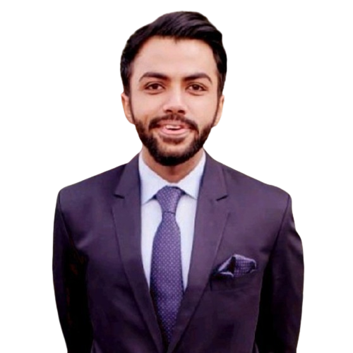

# Syed Alam

I'm Syed Muhammad Alam, an engineer with expertise in Robotics, Biomedical devices, and Machine Learning. My background includes working with perception technologies like RGB/Depth cameras and Lidars, prediction algorithms, and motion planning. My skills range from PyTorch, TensorFlow, and OpenCV to MATLAB simulation tools and Embedded  programming. I have experience in ROS/ROS2 development, embedded systems, and biomedical signal analysis.

## Table of Contents
- [About Me](#about-me)
- [Projects](#projects)
- [Contact](#contact)
- [Resume](#resume)

## About Me

Introduce yourself briefly. Share your background, skills, and what drives your passion for technology. Consider mentioning your career goals or interests.
### Education

- **Master’s Degree:** Lahore University of Management Sciences (2021-2023)
  - Major: Electrical Engineering
  - Concentrations: Robotics, Embedded Systems, Machine Learning

- **Bachelor's Degree:** University of Engineering & Technology (2016-2020)
  - Major: Electrical Engineering
  - CGPA: 3.47

## Projects

### Project 1: Project Name

Provide a short description of the project. Include any relevant technologies used and the project's impact or significance.

[Project 1 Details](project1/README.md) | [Demo](project1/demo)

### Project 2: Project Name

Describe your second project similarly, including a brief overview and any relevant information.

[Project 2 Details](project2/README.md) | [Demo](project2/demo)

<!-- Add more projects as needed -->

## Contact

Feel free to reach out to me! You can connect with me on social media, check out my other profiles, or send me an email.

- Email: [your.email@example.com](mailto:alamsyedmo@gmail.com)
- LinkedIn: [Your LinkedIn Profile](https://www.linkedin.com/in/syedmalam121/)

## Resume
[View Resume](https://github.com/alam121/alam121.github.io/blob/main/SyedAlam_CV.pdf)
